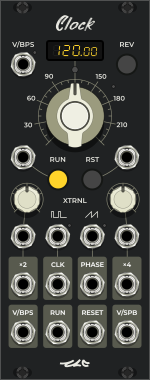

<!---
start: affixing
affixed: blueprint
blueprint: circle-blueprint.svg
preview: circle.svg
-->

# Circle

  

> Dynamic Fractal Live-Looper

> Live-loopers are easily used but they lack the ability to express more than a loop of sounds. Digital-Audio-Workstations can create perfected timelines of sounds, but the mind energy they require interrupts music flow. The `Circle` and `Timeline` modules join to create a workflow with the best of both worlds. With `Circle`, one can live-create a timeline of sound with two buttons and a food pedal. With `Timeline`, one can navigate the timeline so to pass over again and add, remove, apply audio-fx to, sequence, and shape the volume of sounds. The result is a novel music workflow based around live-creation which rivals the expressivity of the DAW.

## Main Panel

<!---
start: legend
-->

<!---
start: legend-group
slug: inputs
-->

### Inputs

<!---
end: legend-group
-->

<!---
start: legend-group
slug: outputs
-->

### Outputs

<!---
end: legend-group
-->

<!---
start: legend-group
slug: controls
-->

### Controls

<!---
end: legend-group
-->

<!---
start: legend-group
slug: indicators
-->

### Indicators

<!---
end: legend-group
-->

<!---
end: legend
-->
<!---
end: affixing
-->

## External Tempo Sources
