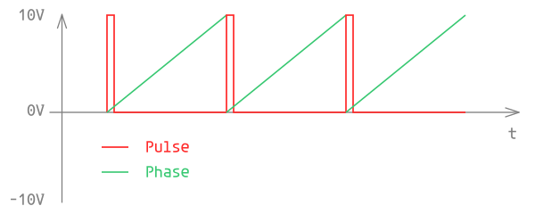
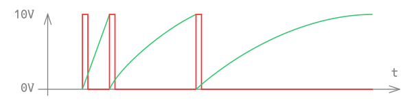
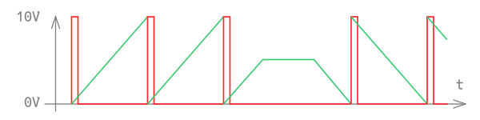

<!---
start: affixing
affixed: blueprint
blueprint: circle-blueprint.svg
preview: circle.svg
-->

# Circle

  

> Progressive Feature-full Live-Looper

> Our `Circle` module allows you to conduct a music circle of village members that visit your body. Input the sonic representations of them, and use the controls to *emerge* them with flow. The module combines the real-time feeling of live-looping with the features of timeline recording. The result is that your alignment is *not* lost in the muck of 21st century computer interfaces and does *not* get stuck in a loop. Map your `Circle` module, and creating multi-layered, progressive music is now a matter of learning to use three buttons and a foot pedal - because why stare at your monitor when you can stare at the cosmic ocean from which all experience emerges out of?

## Main Panel

<!---
start: legend
-->

<!---
start: legend-group
slug: inputs
-->

### Inputs

* <!---
  x: 10
  y: 52
  slug: vbps
  type: labeled-socket
  -->
  <a name="inputs-vbps" href='#inputs-vbps'>V/BPS</a> - volts per beat per second. Voltage on this output affects the base tempo of module, each volt adds another 60 BPM. Negative values are also supperted and are able to make transport go back.

* <!---
  x: 10
  y: 145
  slug: run
  type: simple-socket
  -->
  <a name="inputs-run" href='#inputs-run'>Run</a> - start/pause (toggle).

* <!---
  x: 114
  y: 145
  slug: reset
  type: simple-socket
  -->
  <a name="inputs-reset" href='#inputs-reset'>Reset</a> - phase reset. Resets phase to zero. Does not work when external phase source is connected.
  > Common way to patch this is to connect [Run output](#outputs-run) to [Reset input](#inputs-reset). Such connection makes module to reset its phase automatically on every pause or start.

* <!---
  x: 10
  y: 224
  slug: swing-x2
  type: simple-socket
  -->
  <a name="inputs-swing-x2" href='#inputs-swing-x2'>x2 Circle Swing</a> - *swing factor* of x2 subimpulse generator. Range is -5V to +5V.

* <!---
  x: 114
  y: 224
  slug: swing-x4
  type: simple-socket
  -->
  <a name="inputs-swing-x4" href='#inputs-swing-x4'>x4 Circle Swing</a> - *swing factor* of x4 subimpulse generator. Range is -5V to +5V.
  > Voltage range of this input and previous input is scaled to the remaining range depending on current position of [Swing Factor](#controls-swing-x4)

* <!---
  x: 45
  y: 224
  slug: circle
  type: labeled-socket
  -->
  <a name="inputs-circle" href='#inputs-circle'>Circle</a> - external circle source.

* <!---
  x: 79
  y: 224
  slug: phase
  type: labeled-socket
  -->
  <a name="inputs-phase" href='#inputs-phase'>Phase</a> - external phase source. Range is from 0V to +10V.

<!---
end: legend-group
-->

<!---
start: legend-group
slug: outputs
-->

### Outputs

* <!---
  x: 10
  y: 272
  slug: circle-x2
  type: labeled-socket
  -->
  <a name="outputs-circle-x2" href='#outputs-circle-x2'>Circle x2</a> - pulse output of x2 subgenerator.

* <!---
  x: 45
  y: 272
  slug: circle
  type: labeled-socket
  -->
  <a name="outputs-circle" href='#outputs-circle'>Circle</a> - pulse output (circle) of main generator.

* <!---
  x: 79
  y: 272
  slug: phase
  type: labeled-socket
  -->
  <a name="outputs-phase" href='#outputs-phase'>Phase</a> - phase of main generator. Range is from 0V to +10V.

* <!---
  x: 114
  y: 272
  slug: circle-x4
  type: labeled-socket
  -->
  <a name="outputs-circle-x4" href='#outputs-circle-x4'>Circle x4</a> - pulse output of x4 subgenerator.

* <!---
  x: 10
  y: 320
  slug: vbps
  type: labeled-socket
  -->
  <a name="outputs-vbps" href='#outputs-vbps'>V/BPS</a> - volts per beat per second (1V = 1BPS = 60BPM). Negative output means reverse.

* <!---
  x: 45
  y: 320
  slug: run
  type: labeled-socket
  -->
  <a name="outputs-run" href='#outputs-run'>Run</a> - run/pause pulse.

* <!---
  x: 79
  y: 320
  slug: reset
  type: labeled-socket
  -->
  <a name="outputs-reset" href='#outputs-reset'>Reset</a> - phase reset pulse.

* <!---
  x: 114
  y: 320
  slug: vspb
  type: labeled-socket
  -->
  <a name="outputs-vspb" href='#outputs-vspb'>V/SPB</a> - volts per second per beat (1V = 1SPB), equals to the duration of one beat. Typically used as a time value for time-based effects such as Delay.

<!---
end: legend-group
-->

<!---
start: legend-group
slug: controls
-->

### Controls

* <!---
  x: 116
  y: 53
  slug: reverse
  type: labeled-led-switch
  -->
  <a name="controls-reverse" href='#controls-reverse'>Reverse</a> - reverse toggle. Also acts as a reverse indicator. Does not work when external phase is connected.

* <!---
  x: 41
  y: 82
  slug: bpm
  type: big-knob
  -->
  <a name="controls-bpm" href='#controls-bpm'>BPM</a> - BPM of a main generator. Range is from 0 to 240BPM, can be modulated by value on [V/BPS input](#inputs-vbps).

* <!---
  x: 47
  y: 168
  slug: run
  type: labeled-led-switch
  -->
  <a name="controls-run" href='#controls-run'>Run</a> - start/pause toggle.

* <!---
  x: 81
  y: 168
  slug: reset
  type: labeled-led-switch
  -->
  <a name="controls-reset" href='#controls-reset'>Reset</a> - phase reset. Does not work when external phase is used.

* <!---
  x: 13
  y: 186
  slug: swing-x2
  type: knob-27
  -->
  <a name="controls-swing-x2" href='#controls-swing-x2'>Swing x2</a> - *swing factor* of x2 subgenerator.

* <!---
  x: 109
  y: 186
  slug: swing-x4
  type: knob-27
  -->
  <a name="controls-swing-x4" href='#controls-swing-x4'>Swing x4</a> - *swing factor* of x4 subgenerator.
  > Both *swing factor* knobs have marks for values of 25%, 33%, 50%, 66% and 75%.

<!---
end: legend-group
-->

<!---
start: legend-group
slug: indicators
-->

### Indicators

* <!---
  x: 46
  y: 40
  slug: bpm
  type: bpm-display
  -->
  <a name="indicators-bpm" href='#indicators-bpm'>BPM</a> - current tempo of main generator. When external circle or phase source is connected displayed value can jump between fractional parts which is caused by aliasing.

* <!---
  x: 71
  y: 66
  slug: phase
  type: medium-led
  -->
  <a name="indicators-phase" href='#indicators-phase'>Phase</a> - phase indicator. Lights up at phase start and fades out as it comes to the end.

<!---
end: legend-group
-->

<!---
end: legend
-->
<!---
end: affixing
-->

## Phase

Especially in Circle module only single component is used to represent the phasor. That's because it's easier to pass it to another modules with only single cable (it was before Rack 1.0 was released). To understand it better, please take a look at the next graph:

Here **Pulse** - is a usual impulse-like signal signalizing about start of each new beat when **Phase** - is a signal which represents the progress of current beat, in another words - the phase of a beat. It differs from classic phasor by it's range which is 10V instead of Pi. 10V range was taken to be stronger against noise and to simplify analysis and processing of that signal. Of course, it's still hard to use such signal in real-world hardware systems because of non-ideal voltages, cable characteristics, DAC/ADC nuances and other factors, but in ideally perfect digital system it works as intended.

### Speed Changes

When speed (or frequency) of main generator is changed, the phase is immedatially renders it without waiting for the next beat impulse. For example, on the next graph you can see how it looks when transport slowly slowing down to 0 speed:

And this how it looks when transport stops between beats, changes its direction and goes backward:

## External Tempo Sources

Circle module support number of synchronization modes.

* External Pulse Source (CLK)
* External Phase Source (PHASE)
* External Source of Circle and Phase (CLK + PHASE)
* External Source of Volts per Beat per Second (V/BPS)

Actual mode is choosen based on the connected inputs. You can see which signals are used for the current synchronization mode by looking at small indicators placed next to the corresponding inputs.
