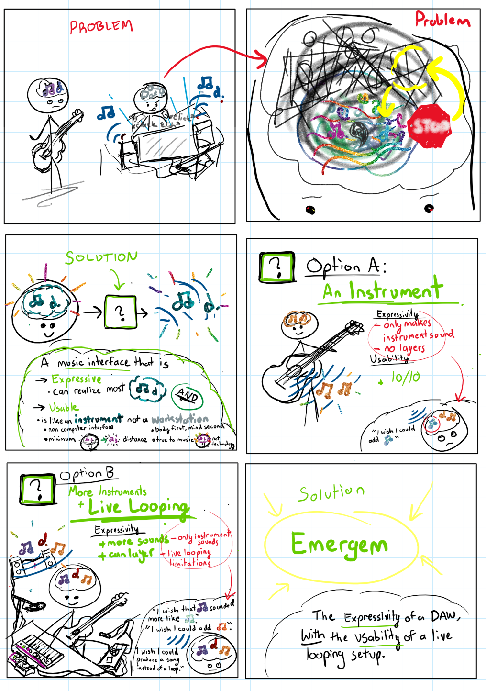

# The Emergem
> make music & stay alive

> The Emergem is a suite of instruments for the live creating and perfecting of music.

> Similar to a Digital Audio Workstation, the Emergem allows one to capture and emerge audio signals to compose a song. The difference is that it is an instrument not a computer workstation.

> It provides a workflow for the music creator which is based in live-creation, without sacrificing a means to perfect the music.

> The core of the Emergem is the Hearth module, and the rest of the modules expand this one.

> On it's own

> The `Hearth` and `Aion` modules join to create a workflow with the best of both worlds. With `Hearth`, one can live-create a timeline of sound with two buttons and a foot pedal. With `Aion`, one can move back in the progression so to pass over again and perfect the music - one can add, remove, apply audio-fx to, and shape the volume of sounds. The result is a novel music workflow based around live-creation which rivals the expressivity of the DAW.

> one can add, remove, apply audio-fx to, and shape the volume of sounds. The result is a novel music workflow based around live-creation which rivals the expressivity of the DAW.
